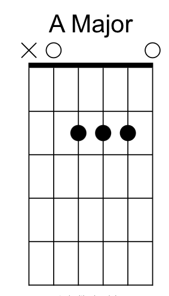

# A Major

Place your 1st (index) finger on the 2nd fret of the 4th string (D).

Place your 2nd (middle) finger on the 2nd fret of the 3rd string (G).

Place your 3rd (ring) finger on the 2nd fret of the 2nd string (B).

Leave the 1st string (E) open.

The 5th and 6th strings (A and E) are played open.

